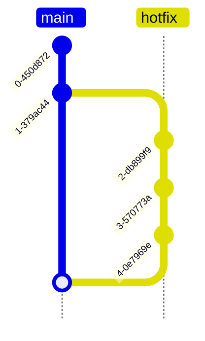
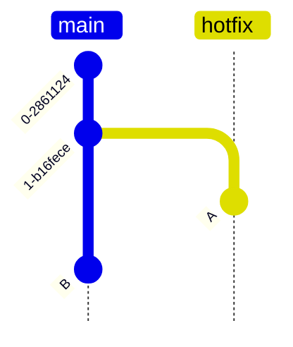

# `--ff`和`--no-ff`

## 简单介绍	

​	通过[git分支的合并策略](https://git-scm.com/book/en/v2/Git-Branching-Basic-Branching-and-Merging)可以大致总结出

​	对于如下的代码提交

​	如果此时要把hotfix分支合并会主分支，使用`git merge hotfix --ff`的结果是这样的，不会产生额外的`commit`，只是移动了`main`分支的指针

​	而使用`git merge hotfix --no-ff`的结果则是这样的，会产生额外的一条`commit`

## 其他

### 默认策略

​	在实际的开发中发现，git默认的合并策略并不固定

​	对于下面的场景，git会默认采用`--ff`的策略

​	而对于下面的场景，git则会默认采用`--no-ff`的策略

### `--ff`不生效的场景

​	对于下面这种场景，git会强制采用`--no-ff`的策略，**即便此时明确在命令中指定了`--ff`且`A`和`B`没有任何冲突**

### 该用什么

​	对于一些对`commit`比较敏感的工具和场景，比如`gerrit`，尽量应使用`--no-ff`的策略，否则合并时可能会被`gerrit`识别为没有新的提交而无法`push`
