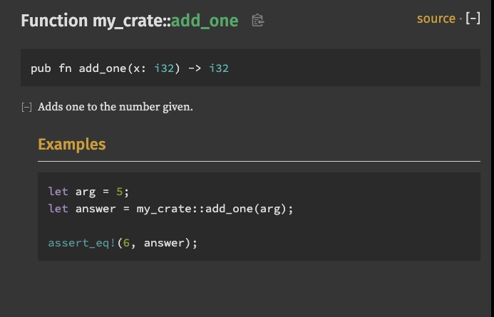
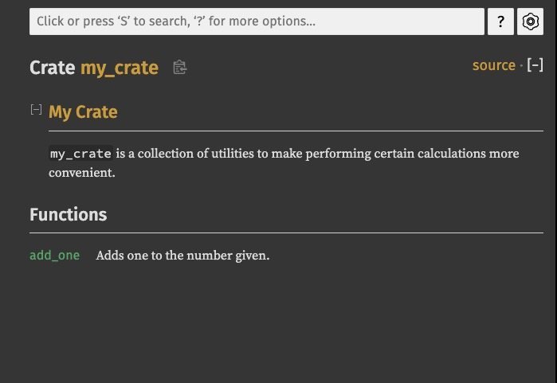
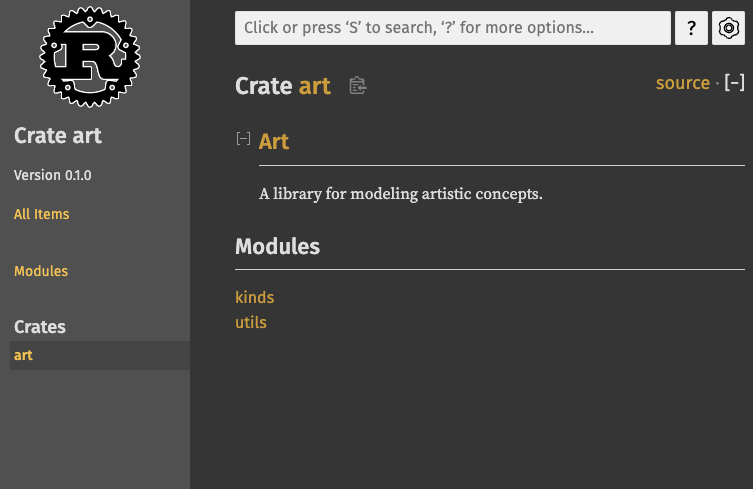
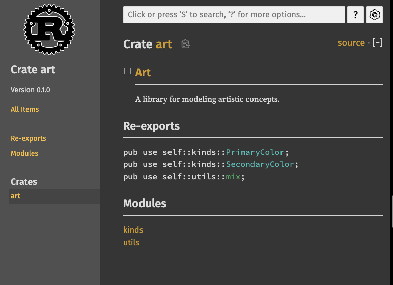

<script setup>
import {
  QuizProvider,
  Quiz,
  Radio,
  RadioHolder,
} from "../../components/quiz"
</script>

# 将Crate发布到crates.io

我们可以使用来自[crates.io](https://crates.io/)的包作为工程的依赖，但你也可以将你自己的包发布上去，分享给其他人。Crate的仓库[crates.io](https://crates.io/)会负责分发你包的源代码，所以它主要负责持有开源的代码。

Rust和Cargo内置了一些特性，它们可以让你轻松地发布你的包，供其他人查看和使用。我们会一一介绍这些特性并详细解释如何发布一个包。

## 书写有用的文档注释

为你的包书写准确的文档可以帮助其他人了解何时以及如何使用你的包，所以在文档上投资时间是绝对值得的。在第三章，我们讨论了Rust中的双斜杠注释，`//`。Rust也有一种特定的书写文档的方式，通常被叫做*文档注释（documentation comment）*，它们可以生成HTML文档。公共API的文档会通过HTML展示内容，这样使用你包的开发者就能了解到如何*使用*你的crate，而无需关心*实现细节*。

文档注释使用三斜杠，`///`，而不是两斜杠，同时支持Markdown语法。你可以将文档注释放置在任何你想注释的内容前。下面的代码展示了给`my_crate`这个crate中的一个`add_one`函数添加文档注释的例子：

```rust
/// Adds one to the number given.
///
/// # Examples
///
/// ```
/// let arg = 5;
/// let answer = my_crate::add_one(arg);
///
/// assert_eq!(6, answer);
/// ```
pub fn add_one(x: i32) -> i32 {
    x + 1
}
```

这里，我们描述了`add_one`函数的行为，从标题`Examples`开始，然后提供了一段示例代码，展示了如何使用`add_one`函数。我们可以运行`cargo doc`将这些文档注释生成为HTML。这条命令会运行Rust附带的`rustdoc`工具，生成的HTML会放置在*target/doc*目录下。

更方便的是，我们可以运行`cargo doc --open`来构建当前crate下的HTML文档（同时还包括这个crate所有依赖的文档）并在浏览器中打开。定位到`add_one`函数，你可以看到刚才的文本是如何被渲染的：



### 常用部分

上面的代码中我们使用`# Examples`创建了一段HTML小节，标题为`Examples`。下面是一些Crate作者在文档中常用的其他标题：

- **Panics**：标记本函数在什么情况下会panic。调用者如果不希望它们的程序panic，就应避免这些情况。
- **Errors**：如果函数返回的是`Result`，这个部分应该描述其可能存在的各种错误以及什么情况下会返回这些错误，这样调用者就可以轻松地调用并处理这些不同的错误情况。
- **Safety**：如果这个函数是`unsafe`的（这部分我们会在第19章讨论），那么应该有一个专门的章节来介绍为什么这个函数是不安全的，并说明函数期望调用者遵守的不变量。

大部分文档注释并不需要全部的这些章节，但这个清单可以帮助你了解你代码的用户关心的角度。

### 文档注释作为测试

在文档中添加实例代码块可以帮助用户理解如何使用你的库，这么做还有一个额外的好处：运行`cargo test`会将文档中的代码作为测试运行！没什么比带示例的文档更棒了。但是也没什么比由于代码不同步导致的错误示例更糟糕了。如果我们使用`cargo test`运行上面的`add_one`函数的文档，我们会看到下面的测试结果：

```
   Doc-tests my_crate

running 1 test
test src/lib.rs - add_one (line 5) ... ok

test result: ok. 1 passed; 0 failed; 0 ignored; 0 measured; 0 filtered out; finished in 0.27s
```

现在不管我们修改了函数本身还是示例代码，例子中的`assert_eq!`都会panic，再次运行`cargo test`，我们就会看到文档测试捕获到了示例和源码不一致的问题！

### 针对元素的注释

`//!`样式的文档注释会将注释添加到包含这些注释的项上，而不是注释后面的项。通常，我们在包根文件（惯例上是*src/lib.rs*）或模块内部使用这种文档注释，用于记录整个包或模块。

比如，要添加一些文档来描述包含了`add_one`函数的`my_crate`这个crate的目的，我们可以在*src/lib.rs*的开头添加如下`//!`开头的注释：

```rust
//! # My Crate
//!
//! `my_crate` is a collection of utilities to make performing certain
//! calculations more convenient.

/// Adds one to the number given.
// 略
```

注意在最后一行以`//!`开头的代码后没有任何代码。因为我们是使用`//!`开始注释的，而不是`///`，我们针对一个元素进行了注释，而不是针对注释紧随其后的元素进行注释。本文件中，也就是*src/lib.rs*文件这个元素，即根crate。这部分注释是针对整个crate的。

当我们运行`cargo doc --open`时，这些注释会在`my_crate`的文档第一页的最上方展示，在所有的公共API前：



针对元素的文档注释对于描述crate和模块来说特别有用。使用它们可以让用户更快地明白crate的目的以及crate的结构。

::: details 小测（2）
<QuizProvider>
<Quiz>
<template #description>

解析：`//!`对于模块顶级别的文档来说是最合适的，而`///`是为了独立的元素，比如函数设计的。

</template>
<template #quiz>

假设你想发布一个库，且你希望在*lib.rs*文件的最上方为整个库书写文档。注释语法该使用以下哪个前缀开头：

<RadioHolder>
<Radio label="//!" answer />
<Radio label="//" />
<Radio label="///" />
</RadioHolder>

</template>
</Quiz>

<Quiz>
<template #description>

解析：不正确的例子会进入文档测试，并导致`cargo test`失败。

</template>
<template #quiz>

假设你创建了一个库`worldly`，且在*lib.rs*中添加了如下函数：

```rust
/// Adds the string "world" to `s`.
///
/// # Example
/// ```
/// let mut s = String::new();
/// worldly::add_world(&mut s);
/// assert_eq!(s, "Hello world");
/// ```
pub fn add_world(s: &mut String) {
    s.push_str("world");
}

#[test]
fn test_add_world() {
    let mut s = String::new();
    add_world(&mut s);
    assert_eq!(s, "world");
}
```

运行`cargo test`，有任何测试会失败吗？

<RadioHolder>
<Radio label="有" answer />
<Radio label="没有" />
</RadioHolder>

</template>
</Quiz>
</QuizProvider>
:::

## 通过`pub use`导出便捷的公共API

在发布crate时，公共API的结构是一个很值得深究的问题。使用你crate的人没有你熟悉这个crate的结构，如果你的crate的层级结构很庞大，那么他们可能很难找到想使用的功能。

在第七章，我们介绍了通过`pub`关键字来将元素设置为公开的，以及通过`use`关键字将元素引入当前域的行为。然而，尽管这样的结构在你开发时可能很方便，但对用户来说却不然。你可能想将你的代码组织成多层级结构，但如果有人想要使用一个很深层的类型，他们可能无法找到这个类型。如果他们最终需要输入`use my_crate::some_module::anther_module::UsefulType;`而不是`use my_crate::UsefulType`也是相当恼火的。

好消息是，如果代码结构对使用库的人来说*不*方便，你也不需要重构内部的组织架构：你只需要使用`pub use`来重新导出元素，使其变为公有的。重导出需要一个位置的公共元素，并在另一个位置使其变为公共的，就好像我们一开始就是在另一个位置定义的一样。

比如，假设我们创建了一个`art`库，它抽象了一些艺术概念。这个库内部存在两个模块：`kinds`模块包含了两个枚举，名为`PrimaryColor`和`SecondaryColor`，而`utils`模块则包含了函数`mix`，代码如下：

```rust
//! # Art
//!
//! A library for modeling artistic concepts.

pub mod kinds {
    /// The primary colors according to the RYB color model.
    pub enum PrimaryColor {
        Red,
        Yellow,
        Blue,
    }

    /// The secondary colors according to the RYB color model.
    pub enum SecondaryColor {
        Orange,
        Green,
        Purple,
    }
}

pub mod utils {
    use crate::kinds::*;

    /// Combines two primary colors in equal amounts to create
    /// a secondary color.
    pub fn mix(c1: PrimaryColor, c2: PrimaryColor) -> SecondaryColor {
        // --略--
    }
}
```

`cargo doc`生成的文档如下：



你会发现，第一页既找不到`PrimaryColor`和`SecondaryColor`类型，也找不到`mix`函数。我们需要点击`kinds`和`utils`才能看到它们。

如果另一个crate想要依赖这个库，那么它需要使用`use`将`art`引入域中，指定模块的结构。代码如下：

```rust
use art::kinds::PrimaryColor;
use art::utils::mix;

fn main() {
    let red = PrimaryColor::Red;
    let yellow = PrimaryColor::Yellow;
    mix(red, yellow);
}
```

上面代码的作者使用`art`这个crate时，需要搞清楚`PrimaryColor`是属于`kinds`模块的，`mix`是属于`utils`模块的才行。但这些结构和`art`的开发者有关，使用者其实并不关心。内部的结构对使用者来说也没有任何有用的信息，反而造成了更多的困扰，因为他们必须查看文档才能找到自己需要的内容。

为了移除公共API的内部结构，我们可以调整`art`的代码，添加`pub use`声明在顶层重新导出元素，代码如下：

```rust
//! #Art
//!
//! A library for modeling artistic concepts.

pub use self::kinds::PrimaryColor;
pub use self::kinds::SecondaryColor;
pub use self::utils::mix;

pub mod kinds {
    // 略
}

pub mod utils {
    // 略
}
```

`cargo doc`为这个crate生成的API文档会在第一页列出所有重导出的元素，这样`PrimaryColor`、`SecondaryColor`和`mix`函数就很容易找到了，如下：



`art`crate的用户可以直接看到他们需要的内容了，这样他们也能书写更加简洁的代码，如下所示：

```rust
use art::mix;
use art::PrimaryColor;

fn main() {
    // 略
}
```

对于嵌套很多的模块来说，在顶层使用`pub use`重导出可以让crate的使用者感受到重大不同。`pub use`的另一个常见用途是重新导出依赖项的定义，使这些定义成为当前包公共API的一部分。

让公共API的结构更好用是一门艺术活，而非技术活，你可以不断迭代来找到最适合你的用户的结构。`pub use`给了你灵活度，让代码内部的灵活度和提供给用户的结构解耦。你可以找一些你感兴趣的crate，看看他们代码的内部结构和公共API有什么不同。

## 设置Crates.io账户

在发布crate前，你需要先在[crates.io](https://crates.io/)上创建一个账户，并获取一个公共的令牌。你可以访问[crates.io](https://crates.io/)的主页并使用GitHub账户登录（GitHub账户目前是必须的，但未来也可能会提供其他注册途径）。登录成功后，你可以在[https://crates.io/me/](https://crates.io/me/)看到你的账户设置，并获取到你的API key。接着，你可以运行`cargo login`命令，粘贴你的API key，如下：

```bash
$ cargo login
abcdefghijklmnopqrstuvwxyz012345
```

这条命令会通知Cargo，它会将你的令牌存储在*~/.cargo/credentials*。注意这个令牌是*私有的*：不要和其他人分享。如果你意外泄露了，你可以在[crates.io](https://crates.io/)重置并生成一个新的令牌。

## 为新Crate添加元数据

如果你想发布你的crate。你需要在*Cargo.toml*文件的`[package]`章节中添加一些元数据。

你的crate需要一个独一无二的名字。当你在本地开发时，你可以随意命名。但是，[crates.io](https://crates.io/)上的名字遵循先到先得的原则。一旦一个crate的名字被使用了，其他人就不能用这个名字发布了。在尝试发布crate前，你可以搜索你想使用的名字。如果名字已经被使用了，你就需要想一个新的名字，然后编辑*Cargo.toml*文件，`[package]`章节下的`name`字段，如下：

```toml
[package]
name = "guessing_game"
```

即便你选择了一个独一无二的名字，运行`cargo publish`来发布crate时，你还是会看到下面的警告：

```bash
$ cargo publish
    Updating crates.io index
warning: manifest has no description, license, license-file, documentation, homepage or repository.
See https://doc.rust-lang.org/cargo/reference/manifest.html#package-metadata for more info.
--snip--
error: failed to publish to registry at https://crates.io

Caused by:
  the remote server responded with an error: missing or empty metadata fields: description, license. Please see https://doc.rust-lang.org/cargo/reference/manifest.html for how to upload metadata
```

这些错误的原因是你遗漏了一些至关重要的信息：一段描述和证书，这样用户才能知道这个crate的作用，以及他们在何种协议下使用它。在*Cargo.toml*中，添加一条一两句话的注释，它会展示在crate的搜索结果里。对于`license`字段，你需要指定一个*许可证标识符值（license identifier value）*。[Linux Foundation's Software Package Data Exchange(SPDX)](https://spdx.org/licenses/)列出了标识符的所有种类。比如，你可以添加`MIT`标识符来指定你的crate使用MIT许可证：

```toml
[package]
name = "guessing_game"
license = "MIT"
```

如果你想使用SPDX没有出现的证书，你需要将证书的内容放在项目中一个文件中，然后使用`license-file`来指定这个文件。

关于为项目选择合适许可证的指导超出了本书的范围。Rust社区中的许多人通过采用`MIT`或`Apache-2.0`的双许可证方式来为其项目授权。这种做法表明，你也可以使用`OR`分隔多个许可证标识符，为项目指定多个许可证。

准备好了独特的名字，版本，描述，以及证书，一个可发布crate下的*Cargo.toml*文件应当如下：

```toml
[package]
name = "guessing_game"
version = "0.1.0"
edition = "2021"
description = "A fun game where you guess what number the computer has chosen."
license = "MIT OR Apache-2.0"

[dependencies]
```

[Cargo的文档](https://doc.rust-lang.org/cargo/)描述了其他你可以指定的元数据，它们可以利于其他人找到并轻松使用你的crate。

## 发布到Crates.io

现在你已经创建了账户，存储了API令牌，为crate选择了合适的名字，并指定了必填的元数据，你已经准备好发布了！发布一个指定版本的crate到[crates.io](https://crates.io/)来供其他人使用。

这个过程需要十分小心，因为一次发布是*永恒的*。一个被发布的版本无法被覆盖，且代码也无法删除。[crates.io](https://crates.io/)的主要目标之一就是扮演一个永久性的代码仓库，这样依赖他的项目可以永远正常工作。允许删除版本会导致这个目标无法实现。然而，一个crate能够发布的版本数是没有限制的。

再次运行`cargo publish`，它可以成功发布了：

```bash
$ cargo publish
    Updating crates.io index
   Packaging guessing_game v0.1.0 (file:///projects/guessing_game)
   Verifying guessing_game v0.1.0 (file:///projects/guessing_game)
   Compiling guessing_game v0.1.0
(file:///projects/guessing_game/target/package/guessing_game-0.1.0)
    Finished dev [unoptimized + debuginfo] target(s) in 0.19s
   Uploading guessing_game v0.1.0 (file:///projects/guessing_game)
```

恭喜你！你已将你的代码和Rust社区分享了，任何人都能将你的代码轻松地添加到他们项目的依赖中。

## 为已存在的Crate发布一个新版本

当你调整了你的crate，并准备发布一个新版本，你可以修改*Cargo.toml*文件中的`version`值，然后重新发布。使用[Semantic Versioning rules](https://semver.org/)来决定你下一个版本号。然后再次运行`cargo publish`来上传新版本。

## 使用`cargo yank`从Crates.io撤销版本

尽管你不能移除crate的旧版本，你可以避免未来的新项目使用他们作为依赖。如果一个crate的版本是存在漏洞，这是十分重要的。这种情况下，Cargo支持*撤销（yanking）*crate的版本。

撤销一个版本可以避免新项目将这个版本添加为依赖，同时允许所有现存的项目继续使用。本质上，撤销意味着拥有*Cargo.lock*的项目不会被破坏，但未来生成的*Cargo.lock*文件不会使用已被撤销的版本。

要撤销一个crate的版本，在你之前发布的crate的目录下运行`cargo yank`，并指定你要撤销的版本。比如，如果你发布了一个版本为1.0.1的`guessing_game`，你可以在`guessing_game`的目录下运行：

```bash
$ cargo yank --vers 1.0.1
    Updating crates.io index
        Yank guessing_game@1.0.1
```

如果你想撤销一次撤销，并允许新项目依赖这个版本，你可以添加`--undo`参数：

```bash
$ cargo yank --vers 1.0.1 --undo
    Updating crates.io index
      Unyank guessing_game@1.0.1
```

一次撤销*不会*删除任何代码。例如，它无法删除意外上传的敏感信息。如果发生这种情况，必须立即重置这些敏感信息。

::: details 小测（2）
<QuizProvider>
<Quiz>
<template #description>

解析：Crates.io不允许覆盖任何已发布的版本。这种情况下最好的选择是撤销那个存在漏洞的版本，然后发布一个修复了漏洞的新版本，比如`v0.1.1`。

</template>
<template #quiz>

如果你发布了一个库`footer`的版本`v0.1.0`。运行了`cargo publish`后，你意识到其中一个函数是有漏洞的。以下哪一个对覆盖这个已发布的`v0.1.0`版本的crate的描述最正确？

<RadioHolder>
<Radio label="运行cargo yank和cargo publish" />
<Radio label="运行cargo publish --overwrite-published" />
<Radio label="无法覆盖一个已发布的crate版本" answer />
<Radio label="登录到Crates.io删除v0.1.0版本的crate" />
</RadioHolder>

</template>
</Quiz>

<Quiz>
<template #description>

解析：为每一个公共函数添加文档是非常推荐的，但并不是默认必须的。请注意，如果你想让Rust将无文档的代码视为错误，你可以在你库的根下添加如下声明：

```rust
#![deny(missing_docs)]
```

</template>
<template #quiz>

以下哪一个步骤**不是**发布crate到Crates.io的必须步骤？

<RadioHolder>
<Radio label="为这个crate的每一个公共函数添加文档" answer />
<Radio label="在Cargo.toml的[package]小节中添加证书" />
<Radio label="注册、登录Crates.io" />
<Radio label="为crate选择一个没有在Crates.io上被注册的名字" />
</RadioHolder>

</template>
</Quiz>
</QuizProvider>
:::
