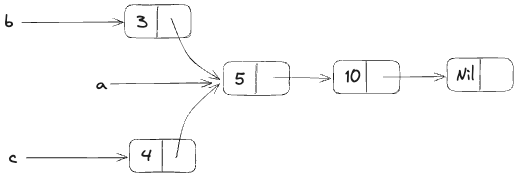

<script setup>
import {
  QuizProvider,
  Quiz,
  IsCompileText,
  IsCompile
} from "../../components/quiz"
</script>

# `Rc<T>`，引用计数指针

大多数情况下，所有权是很清晰的：你可以准确地支持哪一个变量拥有着被给予的值。然而，有的情况下单个值可能会有多个所有者。比如，图数据结构中，多个边可能会指向同一个节点，这个节点概念上来说被所有的边拥有。除非没有边指向它了，否则节点不应该被清理。

想要显式地启用多个所有权，你需要使用Rust内置类型`Rc<T>`，也被成为*引用计数（reference counting）*。`Rc<T>`类型会追踪值的引用数，以此来决定值是否在使用中。如果值的引用数为0，那么这个没有任何有效引用的值就可以被清理了。

你可以把`Rc<T>`想象成客厅里的电视。如果一个家庭成员来看电视，那么它就会打开。其他人也可以加入一起看电视。当最后一个成员离开房间时，他就会关掉电视，因为没有人在使用了。如果有人在其他人使用期间关掉了电视，剩下的观众会非常不高兴！

对于以下场景我们可以使用`Rc<T>`：我们希望将堆中数据共享给程序的多个部分来读取，且我们无法在编译时判断谁是最后一个使用者。如果我们知道，我们就能直接让那一部分代码变为拥有者，常规的所有权规则就能在编译时进行检查了。

注意`Rc<T>`仅供单线程使用。等到我们在第16章中讨论并发性时，我们会讨论如何在多线程程序中进行引用计数。

## 使用`Rc<T>`来分享数据

回顾之前的构造列表。即我们使用`Box<T>`定义的地方。这一次，我们会创建两个列表，它们共享第三个列表的所有权。概念上来说，其结构如下：



我们创建了列表`a`，保存了5和10。让我们创建了两个列表：`b`开始于3，`c`开始于4.`b`和`c`都会指向`a`的头。换句话说，这两个列表页共享了`a`保存的5和10.

你可以尝试使用`Box<T>`来定义`List`，这样是无法生效的，代码如下：

```rust
enum List {
    Cons(i32, Box<List>),
    Nil,
}

use crate::List::{Cons, Nil};

fn main() {
    let a = Cons(5, Box::new(Cons(10, Box::new(Nil))));
    let b = Cons(3, Box::new(a));
    let c = Cons(4, Box::new(a));
}
```

编译这段代码，错误如下：

```
$ cargo run
   Compiling cons-list v0.1.0 (file:///projects/cons-list)
error[E0382]: use of moved value: `a`
  --> src/main.rs:11:30
   |
9  |     let a = Cons(5, Box::new(Cons(10, Box::new(Nil))));
   |         - move occurs because `a` has type `List`, which does not implement the `Copy` trait
10 |     let b = Cons(3, Box::new(a));
   |                              - value moved here
11 |     let c = Cons(4, Box::new(a));
   |                              ^ value used here after move

For more information about this error, try `rustc --explain E0382`.
error: could not compile `cons-list` (bin "cons-list") due to 1 previous error
```

`Cons`变体拥有了其持有的数据，所以当我们创建`b`列表时，`a`会被移入`b`，这样`b`就拥有了`a`。接着，我们尝试使用`a`来创建`c`，这是不被允许的，因为`a`已经被移动了。

我们可以修改`Cons`的定义，使其持有一个引用，但是那样我们就需要指定生命周期参数。通过指定生命周期参数，我们标注了列表里的每个元素都至少和整个列表的生命周期一样长。这样的处理对于上面的代码可以通过，但并不适用于每个场景。

我们可以修改`List`的定义，使用`Rc<T>`取代`Box<T>`，代码如下。每一个`Cons`变体都会持有一个值和一个指向`List`的`Rc<T>`。当我们创建`b`时，`a`的所有权并不会被移动，我们只是克隆了`a`持有的`Rc<List>`，因此引用的计数从一变成了二，`a`和`b`就可以共享`Rc<List>`中的数据了。创建`c`时我们也克隆了`a`，将引用的计数从二增加到了三。每一次调用`Rc::clone`，针对`Rc<List>`的计数都会增加，而其存储的数据不会被清理，除非引用计数为0。

```rust
enum List {
    Cons(i32, Rc<List>),
    Nil,
}

use crate::List::{Cons, Nil};
use std::rc::Rc;

fn main() {
    let a = Rc::new(Cons(5, Rc::new(Cons(10, Rc::new(Nil)))));
    let b = Cons(3, Rc::clone(&a));
    let c = Cons(4, Rc::clone(&a));
}
```

我们需要添加`use`声明来引入`Rc<T>`，因为它不是预置的。在`main`中，我们创建了一个列表存储了5和10的列表，将它存储到了`a`中的`Rc<List>`里。然后，我们创建了`b`和`c`，我们调用了`Rc::clone`函数，将`a`中的`Rc<List>`作为参数传入。

我们可以使用`a.clone()`来替换`Rc::clone(&a)`，但在这里使用`Rc::clone`是更Rust的做法。`Rc::clone`不会像大部分`clone`方法一样对数据进行深拷贝。它只会增加引用计数，这花不了多少时间。而对数据的深拷贝会消耗大量时间。通过使用`Rc::clone`来引用计数，我们可以直观地区分深拷贝和引用计数。当代码存在性能问题时，我们只需要考虑深拷贝的情况，而无需关注`Rc::clone`的调用。

## 克隆`Rc<T>`来增加引用计数

我们来调整之前的代码，看看随着我们创建和销毁引用，`a`中`Rc<List>`的引用数是如何变化的。

下面的代码中，我们修改了`main`函数，将`c`放置到了一个内部作用域；然后我们就可以看到在`c`离开作用域时，引用计数是如何变化的：

```rust
fn main() {
    let a = Rc::new(Cons(5, Rc::new(Cons(10, Rc::new(NIl)))));
    println!("count after creating a = {}", Rc::strong_cont(&a));
    let b = Cons(3, Rc::clone(&a));
    println!("count after creating b = {}", Rc::strong_count(&a));
    {
        let c = Cons(4, Rc::clone(&a));
        println!("count after creating c = {}", Rc::strong_count(&a));
    }
    println!("count after c goes out of scope = {}", Rc::strong_count(&a));
}
```

每次引用计数变化后，我们都会通过调用`Rc::strong_count`获取其值并打印。这个函数名为`strong_count`而不是`count`的原因是，`Rc<T>`上还定义了一个`weak_count`；我们会在后续章节了解`weak_count`的作用。

代码打印如下：

```
$ cargo run
   Compiling cons-list v0.1.0 (file:///projects/cons-list)
    Finished `dev` profile [unoptimized + debuginfo] target(s) in 0.45s
     Running `target/debug/cons-list`
count after creating a = 1
count after creating b = 2
count after creating c = 3
count after c goes out of scope = 2
```

我们可以看到`a`中的`Rc<List>`设置了初始计数1；之后每一次调用`clone`后，这个数字就会增加1。当`c`离开作用域时，这个计数会减去1。我们不需要调用函数来减少引用计数，就像我们调用`Rc::clone`来增加引用计数那样：`Drop`trait的实现促使任何`Rc<T>`类型的值离开作用域时，引用计数都会自动减少。

我们在这个例子里没有看到的是，在`main`函数的最后，`b`和`a`离开作用域后，计数变为了0，`Rc<List>`就被完全清理了。使用`Rc<T>`允许单个值拥有多个所有者，而计数保证了只要有一个所有者，值就是有效的。

通过不可变引用，`Rc<T>`允许我们在程序的多个位置分享同一份只读数据。如果`Rc<T>`允许你创建多个可变数据的话，你可能会违反第四章讨论的借用规则之一：对同一份数据的多个可变引用会造成竟态问题和数据不一致。但是这样做真的很方便！下一章，我们会讨论内部可变范式和`RefCell<T>`类型，你可以结合它和`Rc<T>`，绕开可变引用的限制。

::: details 小测（2）
<QuizProvider>
<Quiz>
<template #description>

解析：`Rc`内部的数据不能被修改，除非使用了内部可变性（下一章会介绍）。`Rc`通过实现`Deref`trait强制而没有实现`DerefMut`确保了这一点。

</template>
<template #quiz>
<IsCompileText />

```rust
use std::rc::Rc;
fn main() {
    let n = Rc::new(1);
    let mut n2 = Rc::clone(&n);
    *n2 += 1;
    println!("{}", n);
}
```

<IsCompile :answer="{ compiled: false }"/>
</template>
</Quiz>

<Quiz>
<template #description>

解析：引用计数指针内的值只会被销毁一次，所以“drop”只会被打印一次。第一次`drop(x)`虽然减少了引用计数，但它并没有销毁内部的值，因为`y`仍然存在。接着，销毁`y`后发现引用计数为0，整个`Example`就被销毁了。

</template>
<template #quiz>
<IsCompileText />

```rust
use std::rc::Rc;
struct Example;
impl Drop for Example {
    fn drop(&mut self) {
        println!("drop");
    }
}
fn main() {
    let x = Rc::new(Example);
    let y = Rc::clone(&x);
    println!("A");
    drop(x);
    println!("B");
    drop(y);
    println!("C");
}
```

<IsCompile
  :textarea="{
    rows: 3
  }"
  :answer="{
    compiled: true,
    result: 'A\nB\ndrop\nC'
  }"
/>
</template>
</Quiz>
</QuizProvider>
:::
