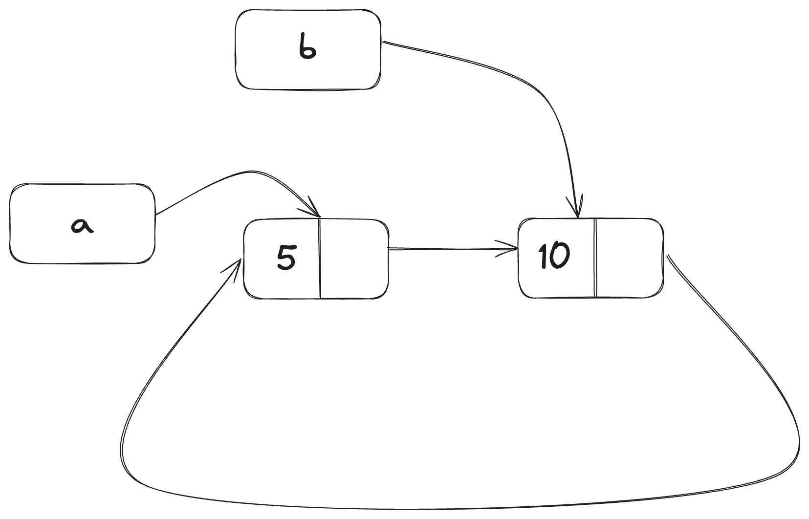

<script setup>
import {
  QuizProvider,
  Quiz,
  IsCompileText,
  IsCompile
} from "../../components/quiz"
</script>

# 循环引用有内存泄露的风险

Rust的内存安全原则使得意外创建永远不会清理的内存（也就是我们常说的*内存泄露（memory leak）*）很难发生，但并非不可能。完全地避免内存泄露并不是Rust的原则之一，也就是说内存泄露在Rust中是内存安全的。使用了`Rc<T>`和`RefCell<T>`的Rust代码等于默认了内存泄露可能发生：可以创建一个元素互相引用的循环。由于引用计数永远不会为0，这种情况下值永远不会被释放，也就造成了内存泄露。

## 创建一个循环引用

我们来看看什么情况下会产生循环引用，以及我们如何避免这种情况的发生，下面的代码展示了一个`List`枚举和`tail`方法：

```rust
use crate::List::{Cons, Nil};
use std::cell::RefCell;
use std::rc::Rc;

#[derive(Debug)]
enum List {
    Cons(i32, RefCell<Rc<List>>),
    Nil,
}

impl List {
    fn tail(&self) -> Option<&RefCell<Rc<List>>> {
        match self {
            Cons(_, item) => Some(item),
            Nil => None,
        }
    }
}

fn main() {}
```

这里我们使用了不同的`List`定义。`Cons`变体中存储的第二个元素变为了`RefCell<Rc<List>>`，也就是说我们不再像之前那样修改`i32`的值，我们想要修改的是`Cons`变体指向的`List`值。我们害添加了`tail`方法来简化我们访问下一个元素的方式。

下面的代码里，我们给`main`函数添加了一些代码。这段代码创建了`a`和`b`两个列表，而`b`中的列表指向了`a`。然后我们修改了`a`中的列表，使其指向了`b`，这样就形成了一个循环引用。整个过程中不断有`println!`声明来展示引用计数在各个节点的值。

```rust
fn main() {
    let a = Rc::new(Cons(5, RefCell::new(Rc::new(Nil))));

    println!("a initial rc count = {}", Rc::strong_count(&a));
    println!("a next item = {:?}", a.tail());

    let b = Rc::new(Cons(10, RefCell::new(Rc::clone(&a))));

    println!("a rc count after b creation = {}", Rc::strong_count(&a));
    println!("b initial rc count = {}", Rc::strong_count(&b));
    println!("b next item = {:?}", b.tail());

    if let Some(link) = a.tail() {
        *link.borrow_mut() = Rc::clone(&b);
    }

    println!("b rc count after changing a = {}", Rc::strong_count(&b));
    println!("a rc count after changing a = {}", Rc::strong_count(&a));

    // 反注释掉下一行，你会看到一个循环
    // 最终会爆栈
    // println!("a next item = {:?}", a.tail());
}
```

我们创建了一个`Rc<List>`实例，存储了`List`值到变量`a`中，初始值为`5, Nil`。接着我们创建了`Rc<List>`实例，存储了另一个`List`到变量`b`中，它包含了`10`和`a`的引用。

我们将`a`进行了修改，使其指向`b`而不是`Nil`，创建了一个循环。我们通过调用`tail`方法获得了一个对`a`中`RefCell<Rc<List>>`的引用，然后将它放入了变量`link`。接着，我们使用`RefCell<Rc<List>>`上的`borrow_mut`方法将存储了`Nil`的`Rc<List>`修改为了存储了`b`的`Rc<List>`。

当我们运行这段代码时，不要反注释最后一行，我们会看到如下输出：

```
$ cargo run
   Compiling cons-list v0.1.0 (file:///projects/cons-list)
    Finished `dev` profile [unoptimized + debuginfo] target(s) in 0.53s
     Running `target/debug/cons-list`
a initial rc count = 1
a next item = Some(RefCell { value: Nil })
a rc count after b creation = 2
b initial rc count = 1
b next item = Some(RefCell { value: Cons(5, RefCell { value: Nil }) })
b rc count after changing a = 2
a rc count after changing a = 2
```

在我们将`a`指向`b`后，`a`和`b`的`Rc<List>`引用计数都变为了2。在`main`函数的结尾，Rust销毁了变量`b`，也就将`b`的`Rc<List>`计数从2减少到了1。但`Rc<List>`所指向的堆内存并不会被销毁，因为它的引用计数为1，而不是0。接着Rust销毁了变量`a`，也就将`a`的`Rc<List>`计数也从2减少到了1。这个实例的堆内存也不会被销毁，因为有其他的`Rc<List>`实例指向了它。分配给这两个列表的内存永远不会被释放了。为了更直观地看这个问题，我们创建了一张图。



如果你反注释掉了最后的`println!`并运行程序，Rust会尝试打印`a`指向的`b`指向的`a`等等等等，直到爆栈。

创建了一个循环引用似乎不会引起什么可怕的后果，但真实世界里则不然：在我们创建了循环引用后，程序结束了。然而，如果一个更复杂的程序在循环里分配了大量内存，且在很长时间里持有了它们，程序就会使用比它原本需求更大的内存，甚至引发系统的崩溃。

创建循环引用并不容易，但也并非不可能。如果你创建了`RefCell<T>`并存入了`Rc<T>`，或者类似的内部可变性和引用计数的嵌套组合结构，你需要确保你没有创建循环；你不能寄希望于Rust来捕获它们。循环引用更像是你程序里的逻辑错误，你需要使用自动化测试，代码审计，以及其他软件开发实践来避免它们。

另一个避免循环引用的方式就是重新组织你的数据结构，让一些引用携带所有权，一些不带。结果就是，你可以拥有一些所有权和非所有权之间的关系，且只有所有权的关系会影响，没有任何值会被删除。在上面的代码里，我们一直希望`Cons`变体拥有列表，所以无法重组数据结构。我们来看一个例子，它使用了由父节点和子节点构成的图结构，你会看到如何利用无所有权的结构来避免循环引用。

## 避免循环引用：将`Rc<T>`转为`Weak<T>`

到目前为止，我们已经证明了调用`Rc::clone`会增加`Rc<T>`实例的`strong_count`，一个`Rc<T>`实例只会在`strong_count`为0时才会被清理。你也可以调用`Rc::downgrade`并传入一个引用给`Rc<T>`来创建一个对值*弱引用（weak reference）*的`Rc<T>`实例。强引用是分享一个`Rc<T>`实例所有权的方式。而弱引用不会涵盖任何所有权关系，它们的计数也不会影响`Rc<T>`是否被清理。它们不会引发循环引用，因为任何包含弱引用的循环都会在强引用的计数归0时被打破。

当你调用`Rc::downgrade`时，你会获得一个`Weak<T>`智能指针类型。和`Rc<T>`实例中对`strong_count`进行加1的行为不同，`Rc::downgrade`会给`weak_count`加1。`Rc<T>`类型使用`weak_count`来追踪有多少个`Weak<T>`引用存在，类似`strong_count`。不同点在于，`weak_count`不需要为0才能清理`Rc<T>`实例。

由于`Weak<T>`的引用值可能被清理，因此对其指向值进行的任何操作都需要确保值存在。你可以调用`Weak<T>`定义的`upgrade`方法，它会返回`Option<Rc<T>>`。如果`Rc<T>`对应的值没有被销毁，你会获得一个`Some`，反之则会获得`None`。由于`upgrade`返回的是`Option<Rc<T>>`，Rust会确保`Some`的情况和`None`的情况都被妥善处理了，不会造成空指针。

我们来举一个例子，和元素只了解下一个元素的列表不同，我们来创建一个树，它的元素了解其子元素*和*父元素。

### 创建树数据结构：一个`Node`和它的子节点

首先，我们来创建一个了解其子节点的树。我们会创建一个名为`Node`的结构体，他会持有自身的`i32`值以及对`Node`子元素的引用：

```rust
use std::cell::RefCell;
use std::rc::Rc;

#[derive(Debug)]
struct Node {
    value: i32,
    children: RefCell<Vec<Rc<Node>>>,
}
```

我们希望一个`Node`可以拥有它的子节点，同时希望变量可以分享它的所有权，来直接访问树的每个`Node`。要实现这种效果，我们可以定义一个存储了`Rc<Node>`的`Vec<T>`。我们也希望在树中移动子节点，所以我们给`Vec<Rc<Node>>`类型的`children`包裹了`RefCell<T>`。

接下来，我们使用我的数据结构来创建一个`Node`实例，名为`leaf`，它的值为3，没有子节点，再创建一个名为`branch`的实例，它的值为5，子节点为`leaf`。代码如下：

```rust
fn main() {
    let leaf = Rc::new(Node {
      value: 3,
      children: RefCell::new(vec![]),
    });

    let branch = Rc::new(Node {
      value: 5,
      children: RefCell::new(vec![Rc::clone(&leaf)]),
    })
}
```

我们克隆了`leaf`里的`Rc<Node>`，将它存储在了`branch`中，也就意味着`leaf`中的`Node`有了两个所有者：`leaf`和`branch`。我们可以通过`branch.children`从`branch`中获取`leaf`，但是无法通过`leaf`获取到`branch`。原因在于`leaf`没有指向`branch`的引用，我们无法得知它们的关系。在下一小节，我们会学习如何让`leaf`明白:`branch`是它的父节点。

### 给子节点添加对父节点的引用

想让子节点了解其父节点，我们需要给`Node`结构体的定义增加`parent`字段。问题在于`parent`的类型。我们已经了解了它不能包括一个`Rc<T>`，否则就会造成`leaf.parent`引用`branch`而`branch.children`引用`leaf`的循环，最终导致`strong_count`永远无法归0。

我们换一个角度来考虑它们的关系，一个父节点应该拥有它的子节点：如果父节点被销毁，那么子节点也应该被销毁。然而，子节点不应该拥有其父节点：如果我们销毁了一个子节点，那么父节点应该继续存在。这就是弱引用的用武之地！

我们这里不使用`Rc<T>`，使用`Weak<T>`来作为`parent`的类型，也就是`RefCell<Weak<Node>>`。最终`Node`结构体的定义应该如下：

```rust
use std::cell::RefCell;
use std::rc::{Rc, Weak};

#[derive(Debug)]
struct Node {
    value: i32,
    parent: RefCell<Weak<Node>>,
    children: RefCell<Vec<Ref<Node>>>,
}
```

这样，一个节点就可以引用其父节点，但不会拥有其父节点。下面的代码里，我们使用这个新的定义更新了`main`函数，这样`leaf`就有办法访问到它的父节点`branch`了：

```rust
fn main() {
    let leaf = Rc::new(Node, {
        value: 3,
        parent: RefCell::new(Weak::new()),
        children: RefCell::new(vec![]),
    });

    println!("leaf parent = {:?}", leaf.parent.borrow().upgrade());

    let branch = Rc::new(Node, {
        value: 5,
        parent: RefCell::new(Weak::new()),
        children: RefCell::new(vec![Rc::clone(&leaf)]),
    });

    *leaf.parent.borrow_mut() = Rc::downgrade(&branch);

    println!("leaf parent = {:?}", leaf.parent.borrow().upgrade());
}
```

创建`leaf`的过程和之前类似，只不过增加了`parent`字段：`leaf`初始状态下并没有父节点，所以我们为其赋值了新的、空的`Weak<Node>`引用实例。

接着，如果我们使用`upgrade`方法来获取`leaf`中对父节点的引用，我们会获得一个`None`值。使用`println!`声明的输出如下：

```
leaf parent = None
```

当我们创建`branch`节点时，它仍会有一个新的`Weak<Node>`引用作为它的`parent`字段值，因为`branch`没有父节点。我们仍然希望`leaf`作为`branch`的子节点之一。在我们拥有了`Node`实例`branch`后，我们可以调整`leaf`的`Weak<Node>`，将其引用到父节点。我们对`leaf`的`parent`字段使用了`RefCell<Weak<Node>>`定义的`borrow_mut`方法，然后使用`Rc::downgrade`创建了`Weak<Node>`引用，引用到了`branch`的`Rc<Node>`。

当我们再次打印`leaf`的父节点时，我们会收到一个持有`branch`的`Some`变体：现在`leaf`可以访问其父节点了！当我们打印`leaf`时，我们也希望避免导致爆栈的循环引用；所以`Weak<Node>`只会被打印为`(Weak)`：

```
leaf parent = Some(Node { value: 5, parent: RefCell { value: (Weak) },
children: RefCell { value: [Node { value: 3, parent: RefCell { value: (Weak) },
children: RefCell { value: [] } }] } })
```

可以看到输出里并没有无限输出，也就表示我们并没有创建循环引用。我们也可以检查`Rc::strong_count`和`Rc::weak_count`来验证这一点。

### 查看`strong_count`到`weak_count`的变化

我们来看看`Rc<Node>`实例中`strong_count`和`weak_count`值随着创建内部作用域、移动`branch`创建所发生的变化。通过这样做，我们可以看到`branch`创建时发生了什么，以及它离开作用域时又发生了什么。调整后的代码如下：

```rust
fn main() {
    let leaf = Rc::new(Node {
        value: 3,
        parent: RefCell::new(Weak::new()),
        children: RefCell::new(vec![]),
    });

    println!(
        "leaf strong = {}, weak = {}",
        Rc::strong_count(&leaf),
        Rc::weak_count(&leaf),
    );

    {
        let branch = Rc::new(Node, {
            value: 5,
            parent: RefCell::new(Weak::new()),
            children: RefCell::new(vec![Rc::clone(&leaf)]),
        });

        *leaf.parent.borrow_mut() = Rc::downgrade(&branch);

        println!(
            "branch strong = {}, weak = {}",
            Rc::strong_count(&branch),
            Rc::weak_count(&branch),
        );

        println!(
            "leaf strong = {}, weak = {}",
            Rc::strong_count(&leaf),
            Rc::weak_count(&leaf),
        );
    }

    println!("leaf parent = {:?}", leaf.parent.borrow().upgrade());
    println!(
        "leaf strong = {}, weak = {}",
        Rc::strong_count(&leaf),
        Rc::weak_count(&leaf),
    );
}
```

在`leaf`被创建后，其`Rc<Node>`的强引用数为1，弱引用数为0。在内侧作用域里，我们创建了引用`leaf`的`branch`，之后我们打印计数时，`branch`里的`Rc<Node>`强引用计数为1，弱引用计数也为1（因为`leaf.parent`使用`Weak<Node>`指向了`branch`）。当我们打印`leaf`里的计数时，我们会看到强引用数为2，因为`branch`拥有了`leaf`的`Rc<Node>`的克隆，存储在了`branch.children`中，但其弱引用计数仍然为0.

当内部作用域结束时，`branch`离开了作用域，其`Rc<Node>`的强引用数减为0，所以`Node`被销毁了。由于`leaf.parent`而存在的弱引用仍为1，但它并不会对`Node`的销毁与否造成影响，所以不会造成任何内存泄露！

如果我们在作用域结束后尝试通过`leaf`访问其父节点，我们会再次收到`None`。在程序最后，`leaf`中的`Rc<Node>`的强引用数为1，弱引用数为0，因为变量`leaf`是对`Rc<Node>`的唯一引用。

所有管理引用计数和值销毁的逻辑都建立在`Rc<T>`和`Weak<T>`以及其对`Drop`trait的实现。通过将子节点到父节点的关系在`Node`的定义中限制为`Weak<T>`，你可以拥有父子节点互相访问的功能，而不会造成任何的循环引用和内存泄露。

## 总结

这一章包括了各种各样的智能指针的使用，以及Rust通过它们来和实现的和普通引用功能上的取舍。`Box<T>`类型拥有确定的大小，它指向堆内分配的内存。`Rc<T>`追踪堆内数据的引用，以便其可以有多个所有者。`RefCell<T>`类型和其内部可变性允许我们将类型对外暴露为不可变，但在内部修改其值；它也将借用规则推迟到了运行时。

我们也讨论了`Deref`和`Drop`trait，它们给智能指针带来了多重能力。同时我们也了解了循环引用造成的内存泄露，以及如何通过`Weak<T>`来避免它们。

如果这一章对你来说很有趣，你想实现自己的智能指针，你可以查看[The Rustonomicon](https://doc.rust-lang.org/nomicon/index.html)来了解更多信息。

下一章，我们会讨论Rust中的异步编程。你还会学到更多新的智能指针。

::: details 小测（1）
<QuizProvider>
<Quiz>
<template #description>

解析：三个强引用分别来自`r1`、`r5`和`r6`。一个弱引用来自`r4`，它会在`main`函数结束时被销毁，而`r2`在内部作用域结束时已被销毁。

</template>
<template #quiz>
<IsCompileText />

```rust
use std::rc::Rc;
fn main() {
    let r1 = RC::new(0);
    let r4 = {
        let r2 = Rc::clone(&r1);
        Rc::downgrade(&r2)
    };
    let r5 = Rc::clone(&r1);
    let r6 = r4::upgrade();
    println!("{} {}", Rc::strong_count(&r1), Rc::weak_count(&r1));
}
```

<IsCompile
  :answer="{
    compiled: true,
    result: '3 1'
  }"
/>
</template>
</Quiz>
</QuizProvider>
:::
