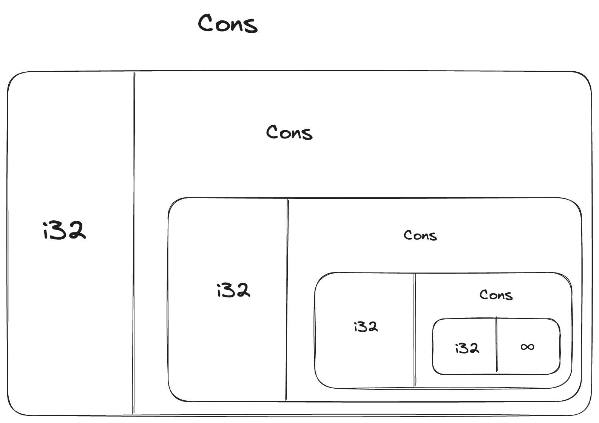
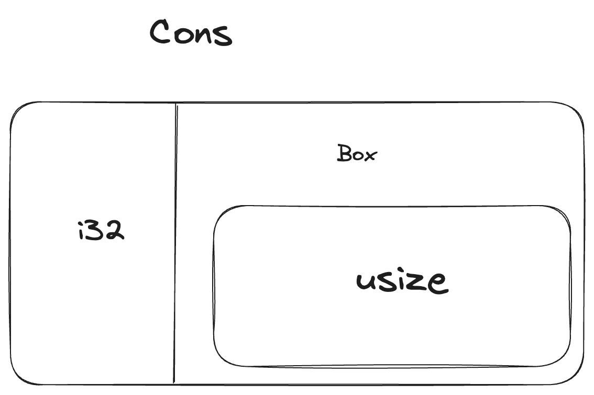

<script setup>
import {
  QuizProvider,
  Quiz,
  Input,
  IsCompileText,
  IsCompile
} from "../../components/quiz"
</script>

# 使用`Box<T>`来引用堆内数据

最简单的智能指针就是*box*，其类型被写作`Box<T>`。Box允许你将数据存储在堆而不是栈中。栈中存储的是指向堆数据的指针。你可以回顾第四章来了解堆和栈的不同。

因为数据存储在了堆中而不是栈中，所以Box没有性能开销。但是它们也没有很多额外的能力。在以下情况你会需要它们：

- 当你的类型大小在编译时未知，而你使用这个类型的上下文中需要准确的类型。
- 当你的数据非常大，你想迁移其所有权的同时保证它不会被拷贝。
- 当你想要拥有一个值，而只希望其类型实现了某个trait而不是特定类型的时。

我们会在“使用Box启用递归类型”中证明第一种情况。对于第二种情况，移动大数据的所有权会花费大量时间，因为数据会在栈内被拷贝。要提高这种情况的性能，我们可以将大量数据存储在堆的box中。最终，只有栈中少量的指针数据会被拷贝，其引用的数据仍然留在堆中的同一个地方。第三种情况被称为*trait对象*，第18章中有一整个完整的章节介绍它。

## 使用`Box<T>`在堆内存储数据

在我们讨论使用`Box<T>`存储堆数据之前，我们先了解一下`Box<T>`相关的语法，以及如何访问其内部的值。

下面的代码展示了如何在堆中存储一个`i32`类型的值：

```rust
fn main() {
    let b = Box::new(5);
    println!("b = {b}");
}
```

我们定义了一个变量`b`，它存储了一个引用了`5`的`Box`，也就是分配了堆内存。这个程序会打印`b = 5`；这种情况下，我们可以像访问栈中数据一样访问它。就像其他被拥有的值一样，当box脱离作用域时，就像`b`在`main`函数结束时一样，它会被销毁。box本身（存储在栈中）和其指向的数据（存储在堆中）都会被销毁。

在堆中存放单个值并没有什么应用场景，所以上面的代码并不常见。类似`i32`这样的单值更适合在栈中，也就是它们默认存储的位置。我们来看看box能做到，而其他类型做不到的场景吧。

## 使用Box实现递归类型

一个*递归类型*的值可以拥有一部分和自己类型相同的值。递归类型对Rust来说是存在一些问题的，因为Rust需要在运行时明确类型，这样才能确定要分配的空间大小。然而，递归类型理论上是无限的，所以Rust无法了解其需要的内存大小。而由于box的大小是已知的，我们可以通过它来实现递归类型。

我们来举一个递归类型的例子，我们来开发一个*构造列表（cons list）*。这是一种在函数式语言中非常常见的类型。除了递归的部分，我们定义的构造列表结构是很简单的；因此，你可以在任何需要复杂递归时候回来看看这个例子。

### 更多关于构造列表的信息

*构造列表*这种数据结构最早来自于Lisp编程语言，它由嵌套对组成，也是链表的Lisp实现。它的名字来自于Lisp语言中的`cons`函数（也就是“construct function”的缩写），它可以使用它的两个参数来构造一个新的对。通过调用`cons`函数，传入值和另一个对，我们可以实例化一个递归结构的构造列表。

比如，下面是构造列表的伪代码：

```
(1, (2, (3, Nil)))
```

构造列表中的每个元素都是一个对：它包含了当前值和下一个元素。最后一个元素只包含一个`Nil`，不包含下一个元素。一个构造列表可以通过递归地调用`cons`来实现。表示递归的基本情况就是`Nil`。注意它不是第六章提到的“null”或者“nil”的概念，它们表示无效的或者缺失的值。

构造列表在Rust中并不是一个常用的数据结构。大部分情况下如果你需要一个列表，`Vec<T>`是更好的选择。但是，更复杂的递归结构在某些情况下也*是*很有用的，但是在开始定义构造列表之前，我们可以探索一下box如何帮助我们定义递归结构，且不会分散我们的注意力。

下面的代码是构造列表中的枚举定义。注意这段代码是无法编译的，因为`List`类型没有明确的大小，后面我们会重构：

```rust
enum List {
    Cons(i32, List),
    Nil,
}
```

> [!NOTE]
> 我们目前实现的构造列表为了展示当前的例子，只保存了`i32`类型的值。我们也可以使用泛型，就像第十章讨论过的一样，来定义一个可以存储任意类型的构造列表。

使用这个`List`结构来存储`1, 2, 3`的话，代码如下：

```rust
use crate::List::{Cons, Nil};

fn main() {
    let list = Cons(1, Cons(2, Cons(3, Nil)));
}
```

第一个`Cons`值存储了`1`和另一个`List`值。而`List`值是另一个`Cons`值，它存储了`2`和另一个`List`值。这个`List`也是一个`Cons`值，它存储了`3`和一个`List`值，也就是`Nil`，这个变体是递归结束的信号。

如果我们试图编译这段代码，我们会看到如下报错：

```
$ cargo run
   Compiling cons-list v0.1.0 (file:///projects/cons-list)
error[E0072]: recursive type `List` has infinite size
 --> src/main.rs:1:1
  |
1 | enum List {
  | ^^^^^^^^^
2 |     Cons(i32, List),
  |               ---- recursive without indirection
  |
help: insert some indirection (e.g., a `Box`, `Rc`, or `&`) to break the cycle
  |
2 |     Cons(i32, Box<List>),
  |               ++++    +

error[E0391]: cycle detected when computing when `List` needs drop
 --> src/main.rs:1:1
  |
1 | enum List {
  | ^^^^^^^^^
  |
  = note: ...which immediately requires computing when `List` needs drop again
  = note: cycle used when computing whether `List` needs drop
  = note: see https://rustc-dev-guide.rust-lang.org/overview.html#queries and https://rustc-dev-guide.rust-lang.org/query.html for more information

Some errors have detailed explanations: E0072, E0391.
For more information about an error, try `rustc --explain E0072`.
error: could not compile `cons-list` (bin "cons-list") due to 2 previous errors
```

错误表示这个类型“有无限大（has infinite size）”。原因在于我们定义了`List`，它的变体是递归的：它包含了一个存储了自身类型值的值。结果就是，Rust无法确定存储一个`List`需要多大的空间。我们来分析一下为什么会出现这个问题。首先，我们来看看Rust存储一个非递归类型时是如何决定大小的。

### 计算非递归类型的大小

回顾第六章中定义的`Message`枚举：

```rust
enum Message {
    Quit,
    Move { x: i32, y: i32 },
    Write(String),
    ChangeColor(i32, i32, i32),
}
```

要决定我们为`Message`分配多少值，Rust会遍历其中的每个变体，看看它们分别需要的最大值。Rust会发现`Message::Quit`不需要任何空间，而`Message::Move`需要能够存储两个`i32`的空间，等等。由于最终我们只会使用一个变体，所以`Message`所需要的最大空间就是这些变体中空间需求最大的那个。

对比这个模式，你就明白Rust在尝试判断一个递归类型的大小时，比如之前的`List`，会发生什么了。编译器会开始查看`Cons`变体，它存储了一个`i32`和一个`List`。因此，`Cons`需要一个`i32`加上一个`List`大小的空间。要摸清楚`List`需要多少空间，编译器又要查看`Cons`变体的大小，而`Cons`包含了一个`i32`和一个`List`。这个过程无穷无尽，如下图所示：



### 使用`Box<T>`来确定递归类型的大小

由于Rust无法决定要为递归类型分配多大的内存，编译器抛出了错误和下面的提示：

```
help: insert some indirection (e.g., a `Box`, `Rc`, or `&`) to break the cycle
  |
2 |     Cons(i32, Box<List>),
  |               ++++    +
```

在这段提示里，“indirection（间接的）”表示非直接强绑定的值，我们可以让这个数据结构通过指针来间接地存储值，而不是直接地存储值本身。

由于`Box<T>`是一个指针，Rust永远明白`Box<T>`需要的大小：一个指针的大小不会随其指向数据的大小而变化。也就是说，我们可以在`Cons`中存储一个`Box<T>`，而不是直接存储`List`。`Box<T>`会指向下一个`List`值对应的堆内存，而不是其`Cons`变体。概念上讲，我们仍然拥有一个列表，且存储了另一个列表，但这样的实现更像将元素相邻放置，而不是嵌套放置。

我们可以修改`List`枚举的定义及其使用，这样就可以成功编译了，代码如下：

```rust
enum List {
    Cons(i32, Box<List>),
    Nil,
}

use crate::List::{Cons, Nil};

fn main() {
    let list = Cons(1, Box::new(Cons(2, Box::new(Cons(3, Box::new(Nil))))));
}
```

`Cons`变体需要一个`i32`的大小加上一个box指针的大小。`Nil`变体不需要存储值，所以它需要的空间比`Cons`变体更小。我们就可以明确任何`List`值需要的大小就是一个`i32`加上一个box指针的大小。通过使用box，我们打破了无穷无尽的递归链，这样编译器就可以明确`List`存储内容所需要的大小了。下面的代码就是一个`Cons`变体的示例：



Box只提供了间接访问和堆内存分配；他们没有任何其他能力，就像其他的智能指针一样。它也不会产生那些能力所产生的开销，所以在本例中它是非常实用的，我们只需要它提供的间接性。我们会在第17章讨论box的更多使用场景。

`Box<T>`类型是一个智能指针，因为它实现了`Deref`trait，它允许`Box<T>`被看做一个引用，当`Box<T>`离开作用域时，其指向的堆内存也会被清理，这是因为它实现了`Drop`trait。这两个trait对于后续我们要讨论的其他智能指针来说也是尤为重要的。我们来继续看看它们的细节吧。

::: details 小测（2）
<QuizProvider>
<Quiz>
<template #description>

解析：一个box可以存储可变引用，所以解引用`b`两次后会得到`n`。

</template>
<template #quiz>
<IsCompileText />

```rust
fn main() {
    let mut n = 1;
    let b = Box::new(&mut n);
    **b += 1;
    println!("{}", n);
}
```

<IsCompile
  :answer="{
    compiled: true,
    result: '2'
  }"
/>
</template>
</Quiz>

<Quiz>
<template #description>

解析：一个box包含了一个指针，在64位系统下，一个指针的大小是8字节。而一个包含了4个指针的数组需要至少4*8=32字节。

</template>
<template #quiz>

假设我们的程序中存在一个变量

```rust
let x: [Box<(usize, usize)>; 4] = /* ... */
```

要在64位系统下编译，`x`在栈中所需要的最小字节是多少？使用数字表示你的答案。

<Input answer="32" />
</template>
</Quiz>
</QuizProvider>
:::
