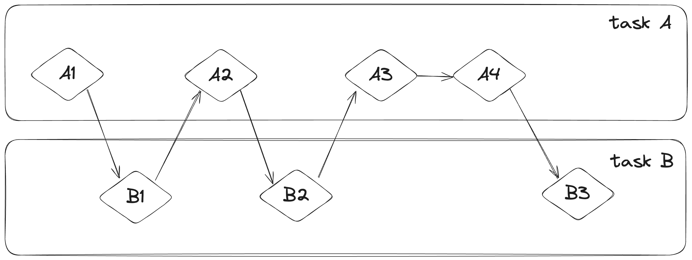
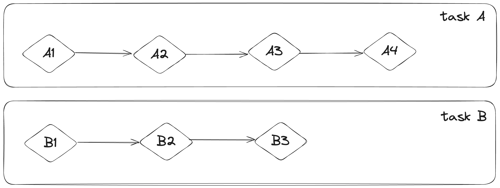

# `Async`和`Await`

我们要求计算机进行的许多操作会很耗时。比如，在你使用视频剪辑软件对家庭聚会的视频进行剪辑时，导出它可能需要几分钟甚至几个小时。类似的，下载家庭成员分享的视频也会花费很长时间。如果我们能在等待这些长任务完成时做些什么就好了。

视频导出会尽可能地利用CPU和GPU的资源。如果你的CPU只有一个核心，那么你的操作系统在导出完成前是不会停止的，你也不能在此期间做其他事。这种体验非常不好。反之，你的操作系统可以————它确实可以！————偷偷地中断导出任务，空闲出时间来让你完成其他事。

文件下载则不同。它需要大量的CPU时间。此时，CPU需要等待来自网络的数据。虽然你可以开始读取已经下载好的部分了，但剩余的部分还需要一些时间才能显示。即便数据已经下载好了，一个视频也可能会非常大，需要一些时间才能载入它。也许只需要1到2秒————对于现代的处理器来说也是相当长的时间了，它能在每秒进行数十亿的操作。如果在等待网络资源的时候让CPU去做其他事就好了————所以，再一次的，你的操作系统会偷偷地中断你的程序，这样其他的程序可以在网络请求完成前运行。

> [!NOTE]
> 视频导出是一种常常被称为“CPU限制”或“计算限制”的操作。它受限于*CPU*或*GPU*处理数据的速度，以及这些速度能利用多少。而视频下载则是一种被称为“IO限制”的操作，它受限于计算机*输入输出*的速度。它跟网络数据传输速度有关。

在这些例子里，操作系统的中断提供了一种并发。这样的办法只能发生在应用层级，即：操作系统中断一个程序来让其他程序运行。很多情况下，由于我们对程序的理解比操作系统更精细，我们能看到更多操作系统无法识别的并发机会。

比如，如果我们开发了一个工具来管理文件下载，我们应该这样开发：开始下载一个文件不会阻塞用户界面，用户仍然可以同时开始其他文件的下载。虽然很多操作系统和网络交互的API是*阻塞性*的。也就是说，这些API会阻塞程序的运行，直到它们完全处理完毕。

> [!NOTE]
> 如果你仔细思考，这是*大部分*函数工作的方式！然而，我们通常将“阻塞”一词保留用于与文件、网络或计算机上的其他资源交互的函数调用，因为这些地方是单个程序从非阻塞操作中获益的场景。

我们可以通过为每一个文件下载开启单独的线程来避免阻塞主线程。然而，最终这些线程的消耗会是一个问题。如果一开始我们的调用就不是阻塞的就好了。最后但不是最不重要的是，如果我们能用阻塞性代码一样的方式进行开发就好了。比如：

```rust
let data = fetch_data_from(url).await;
println!("{data}");
```

这就是Rust的async抽象给予我们的能力。在我们查看它如何实现前，我们需要先看看并行和并发的差异。

## 并行和并发

在前一章中，我们把并行和并发看作是可替换的概念。但现在我们需要将它们明确区分开了，因为本章要讨论的内容正是它们的差异。

你可以想象一个团队在软件开发过程中的不同分工。我们可以为一个人分配多项任务，或者我们可以给每个团队成员分配一个任务，也可以混合这两种方式。

当一个人在其他任务没有结束的情况下就开始处理其他任务，这就是*并发*。你可能会在电脑上同时进行两个项目，当你感到无聊或遇到困难停滞在一个项目时，你就切换到另一个项目。你是一个人类，所以你无法同时处理两个项目————但你可以多任务，通过交换来推进多个任务。



如果你认为应该分为小组来处理不同的项目，那么小组内的成员处理的任务就是单一的，这就是*并行*。各个小组的进展可以同步进行。



不管是那种策略，你都需要协同多个不同的任务。也许你*认为*个人执行的任务应该完全和其他人的工作分开，但实际上它需要团队的其他成员来完成。有些工作可以并行完成，有些则需要*串行*：它只能以系列的方式发生，一件接一件。同样的，你可能会意识到你的任务依赖于其他人的任务。现在你的并行工作也变为了串行。

并行和并发也可以互相交错。如果你发现你的同事卡在了你的任务之一，你可能需要尽最大努力完成那项任务来“解放”你的同事。你和你的同事都无法并行工作了，你也不能在自己的环境中并发工作了。

软硬件工作的原理也基本相同。在一台单核CPU的机器上，CPU只能同时处理一个操作，但它仍可以并发工作。使用类似线程、流程和async这样的工具，计算机可以暂停一项任务，并切换到其他任务上，最后再回来。在多核CPU上，它也可以并行工作。一个核心可以处理一件事，和其他核心完全无关，且同时进行。

在使用Rust的async开发时，我们会经常性地处理并发性。取决于硬件，操作系统和我们使用的async运行时————稍后会详细介绍————并发有可能在底层使用并行。

现在，我们来深入了解Rust是如何运行async代码的！在本章中，我们会：

- 看看Rust的`async`和`.await`语法。
- 探索如何使用async模型来解决我们第16章遇到的问题。
- 探索多线程和async互为补充的方案，你甚至可以同时使用它们。
