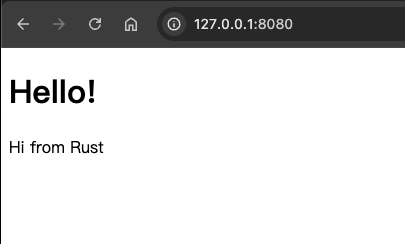

# 最终项目：构建一个多线程Web服务器

我们经过了漫长的旅程，但我们终于到了本书的尾声。在本章中，我们会构建一个项目来阐述上一章里的概念，也会回顾之前的知识点。

在这个最终项目里，我们会创建一个Web服务器，它会响应“hello”，并在浏览器中显示如下内容：

下面是我们的目标：

1. 了解有关TCP和HTTP的一些知识。
2. 监听socket上的TCP连接。
3. 处理小数量的HTTP请求。
4. 创建一个正式的HTTP响应。
5. 使用线程池提高服务的吞吐量。

在我们开始之前，需要先介绍两个细节。首先，我们使用的方式并不是使用Rust构建Web服务器的最佳方式。社区里在[crates.io](https://crates.io/)上发布了很多生产级的crate，它们提供了更加完整的网络服务器和线程池的实现。然而，本章的目的在于帮助你学习，而不是走捷径。由于Rust是一门系统级编程语言，我们可以自由选择我们想要抽象的级别，这在其他语言中要么做不到，要么不切实际。

其次，我们不会使用async和await。不引入async运行时，创建线程池对我们来说已经是一个很大的挑战了！然而，我们也会在某些问题里标注使用async和await是更合适的办法。最终，就像我们在第17章提过的一样，许多async运行时都使用线程池来管理它们的任务。

因此，我们将手动编写基本的HTTP服务和线程池，以便你可以了解一些将来使用的crate背后的原理和技术。
